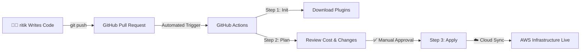
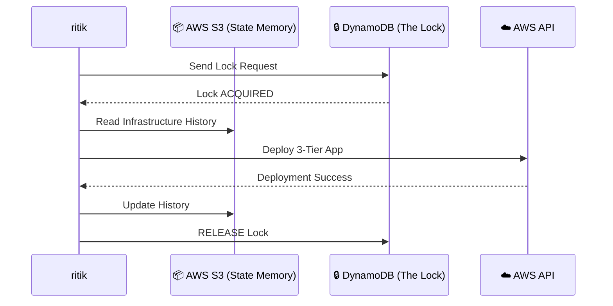

# 🏰 Day 0: The Advanced Foundation of IaC
> **Status:** The Master Blueprint

---

## 1. 🔄 The Industry Standard Workflow
In production, we follow the **GitOps Life Cycle**. It ensures every change is reviewed, tested, and automated.

### 💎 The "DevOps Gold" Principles
- **Idempotency:** Re-running the code = No unintended changes. Safe and predictable.
- **Drift Detection:** Terraform detects if someone "messed up" the settings in the AWS Console.

---

## 2. 🏗️ Your Learning Phases

| Phase | Icon | Goal | focus |
| :--- | :---: | :--- | :--- |
| **Foundations** | 🏗️ | Build the Network | IAM & VPC |
| **Live Systems** | ⚡ | Build the Apps | EC2, RDS, ALB |
| **Advanced** | 🧙‍♂️ | Scaling | Modules & Workspaces |
| **Enterprise** | 🏢 | Production | CI/CD & Secrets |

---

## 💾 3. State Management: The "Brain" of Terraform
This is how multiple engineers work together without deleting each other's work.

---

## 📜 4. The DevOps Cheat Sheet
- **Provider:** The bridge between HCL and the AWS API.
- **Resource:** A single building block (e.g., an EC2 instance).
- **Backend:** Where the "memory" (State file) lives.
- **Data Source:** Reading information that already exists in AWS.

---

### 🚀 Next Step: 
Go to [Day 1: IAM Fundamentals](file:///c:/Users/Nikhil%20Sharma/Desktop/terraform_roadmap/labs/day01-iam-terraform/README.md) to build your first resource!
