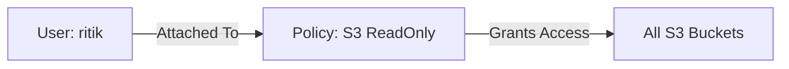

# 🛡️ Day 1: Identity & Access Management (IAM)
> **Topic:** Controlling the Keys to the Kingdom

---

## 🎯 1. The "Why" - Why are we doing this?
In a real company, if you give everyone the "Root" account, one mistake can delete the whole company. We use **IAM** to follow the **"Principle of Least Privilege"**—give users ONLY what they need to do their job.

**Real World Use Case:** You hire a junior developer. You don't give them access to the billing or the database; you only give them access to a specific S3 bucket to upload images.

---

## 🛠️ 2. Core Concepts & Definitions
- **IAM User:** A digital identity for a person or service.
- **IAM Policy:** A JSON document that defines "Who" can do "What" on "Which" resource.
- **Policy Attachment:** The link that connects the User to the Policy.
- **Principle of Least Privilege:** Security best practice where users have the minimum permissions necessary.

---

## 🔍 3. Line-by-Line Code Explanation (`main.tf`)

```hcl
provider "aws" {
  region = "us-east-1"
}
```
- **Line 1:** `provider "aws"` - Tells Terraform to download the AWS plugin.
- **Line 2:** `region = "us-east-1"` - Specifies the physical location (North Virginia) where our resources will be created.

```hcl
resource "aws_iam_user" "dev_user" {
  name = "ritik"
}
```
- **Line 6:** `resource "aws_iam_user"` - The type of resource we are making.
- **Line 6:** `"dev_user"` - The **Internal ID** (Logical Name). Used only inside Terraform.
- **Line 7:** `name = "ritik"` - The **Physical Name**. This is what shows up in the AWS Console.

```hcl
resource "aws_iam_policy" "s3_read_only" {
  name        = "S3ReadOnlyAccess-TF"
  description = "Allows read access to S3 buckets"

  policy = jsonencode({
    Version = "2012-10-17"
    Statement = [
      {
        Action   = ["s3:Get*", "s3:List*"]
        Effect   = "Allow"
        Resource = "*"
      },
    ]
  })
}
```
- **Line 11:** `aws_iam_policy` - Creating a new custom permission rule.
- **Line 15:** `jsonencode` - A function that converts our easy-to-read HCL code into the complex JSON format that AWS requires.
- **Line 19:** `Action = ["s3:Get*", "s3:List*"]` - Specifies that the user can ONLY read and list files. They cannot delete (`s3:DeleteObject`) or create.
- **Line 21:** `Resource = "*"` - This permission applies to ALL S3 buckets in the account.

```hcl
resource "aws_iam_user_policy_attachment" "attach_s3" {
  user       = aws_iam_user.dev_user.name
  policy_arn = aws_iam_policy.s3_read_only.arn
}
```
- **Line 29:** `user = aws_iam_user.dev_user.name` - References the name "ritik" dynamically.
- **Line 30:** `policy_arn` - References the unique Amazon Resource Name (ARN) of the policy we just made.

---

## 🏗️ 4. Architectural Design


---

## 🧠 5. Senior DevOps Insight
- **Never Use Access Keys for Long:** For local development, use `aws sso login` or temporary credentials. Hardcoded access keys are the #1 cause of cloud hacks.
- **Naming Conventions:** Use a standard like `[Env]-[Component]-[Resource]` (e.g., `prod-web-iam-role`).

---

### 🛠️ Hands-on Tasks:
- [ ] Run `terraform init`.
- [ ] Run `terraform plan` and verify that exactly **3 resources** will be added.
- [ ] Run `terraform apply`.
- [ ] **Verification:** Log into the AWS Console and check if the user 'ritik' exists with the policy attached.

---
<p align="center">
  <b>Graduation progress: Day 1/20 ✅</b>
</p>
