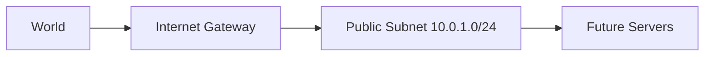

# 🌐 Day 2: VPC Networking Foundation
> **Topic:** Building your Private Cloud from Scratch

---

## 🎯 Today's Mission
Today we build the **Virtual Private Cloud (VPC)**. This is not just a network; it's the secure perimeter of your entire infrastructure.

---

## 🔍 Line-by-Line Code Breakdown

### 🗺️ Part 1: IP Range Definition
```hcl
resource "aws_vpc" "main" {
  cidr_block           = "10.0.0.0/16"
  enable_dns_hostnames = true
}
```
- **Range:** `10.0.0.0/16` gives you the largest possible network (~65k IPs).
- **DNS:** We enable hostnames so our servers have human-readable names.

### 🚪 Part 2: The Internet Gateway
```hcl
resource "aws_internet_gateway" "igw" {
  vpc_id = aws_vpc.main.id
}
```
- **Function:** This is the router that connects your private cloud to the World Wide Web.

### 📍 Part 3: The Public Subnet
```hcl
resource "aws_subnet" "public_1" {
  cidr_block              = "10.0.1.0/24"
  map_public_ip_on_launch = true
}
```
- **Public access:** `map_public_ip_on_launch = true` ensures that any server launched here can be reached by you.

---

## 🏗️ 2. Architectural Design


---

### 🧠 How to write like a Senior
1. **Plan your CIDRs:** Never guess IP ranges. Use a tool like [CIDR.xyz](https://cidr.xyz/) to visualize your network before you code it.
2. **Tag Everything:** In a real job, you might have 50 VPCs. Without tags, you are lost.

---
<p align="center">
  <b>Graduation progress: Day 2/20 ✅</b>
</p>
