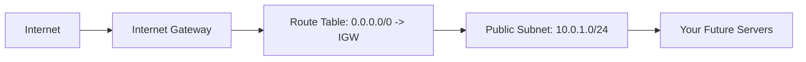

# 🌐 Day 2: VPC Networking Foundation
> **Topic:** Building your Private Cloud from Scratch

---

## 🎯 1. The "Why" - Why are we doing this?
A **VPC (Virtual Private Cloud)** is your own private slice of the AWS cloud. Without a VPC, your servers would be floating in the open internet, exposed to everyone. A VPC creates a security boundary.

**Real World Use Case:** Imagine a bank. The VPC is the **Bank Building**. The subnets are the **Rooms**. The Internet Gateway is the **Front Door**.

---

## 🛠️ 2. Core Concepts & Definitions
- **CIDR (Classless Inter-Domain Routing):** A way to define a range of IP addresses (e.g., `10.0.0.0/16`).
- **Subnet:** A subdivision of your VPC. You put servers in subnets.
- **Internet Gateway (IGW):** A component that allows communication between your VPC and the internet.
- **Route Table:** A set of rules (routes) that determine where network traffic is directed.

---

## 🔍 3. Line-by-Line Code Explanation (`main.tf`)

```hcl
resource "aws_vpc" "main" {
  cidr_block           = "10.0.0.0/16"
  enable_dns_hostnames = true
  tags = {
    Name = "main-vpc"
  }
}
```
- **Line 6:** `aws_vpc` - creates the virtual network.
- **Line 7:** `cidr_block = "10.0.0.0/16"` - Defines the size. `/16` means you have 65,536 available internal IP addresses.
- **Line 8:** `enable_dns_hostnames` - If true, servers in this VPC get a public DNS name (like `ec2-54...compute-1.amazonaws.com`).

```hcl
resource "aws_internet_gateway" "main_igw" {
  vpc_id = aws_vpc.main.id
}
```
- **Line 14:** `aws_internet_gateway` - Creates the "Door" to the internet.
- **Line 15:** `vpc_id` - Links this door to our specific building (VPC).

```hcl
resource "aws_subnet" "public_subnet" {
  vpc_id                  = aws_vpc.main.id
  cidr_block              = "10.0.1.0/24"
  map_public_ip_on_launch = true
}
```
- **Line 19:** `aws_subnet` - Creates a "Room" inside the building.
- **Line 21:** `10.0.1.0/24` - A smaller slice of the VPC (~256 IPs).
- **Line 22:** `map_public_ip_on_launch = true` - This makes it a **Public Subnet**. Any server here gets a public IP address automatically.

---

## 🏗️ 4. Architectural Design


---

## 🧠 5. Senior DevOps Insight
- **Plan for Growth:** Never use a small CIDR like `/28` for a VPC. You will run out of IPs and have to rebuild the entire network. `/16` is the industry standard for starting a VPC.
- **Availability Zones:** In production, always create subnets in at least two different AZs (e.g., `us-east-1a` and `us-east-1b`) for high availability.

---

### 🛠️ Hands-on Tasks:
- [ ] Run `terraform apply`.
- [ ] Check the AWS Console: Networking -> VPC.
- [ ] **Verification:** Find your VPC and check if the "Internet Gateway" is attached correctly in the "Resource Map."

---
<p align="center">
  <b>Graduation progress: Day 2/20 ✅</b>
</p>
