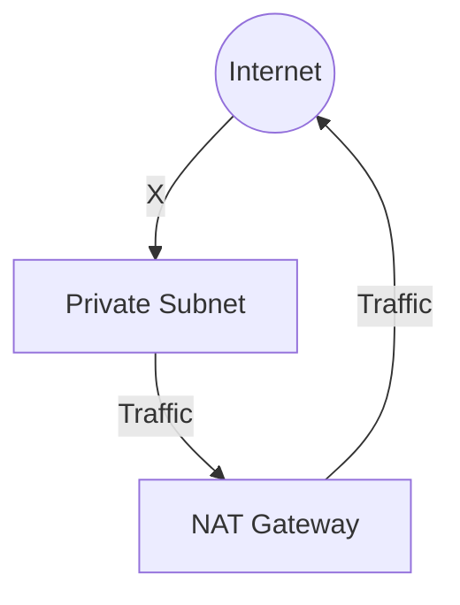

# 🕵️ Day 3: Private Isolation & NAT Gateways
> **Topic:** The Art of Hiding Your Infrastructure

---

## 🎯 Today's Mission
Today we achieve **True Security**. We will create **Private Subnets** for our sensitive resources (like Databases) and set up a **NAT Gateway** so they can talk to the internet without the internet talking to them.

---

## 🔍 Line-by-Line Code Breakdown

### 🔒 Part 1: The Invisible Subnet
```hcl
resource "aws_subnet" "private_1" {
  cidr_block        = "10.0.2.0/24"
  map_public_ip_on_launch = false
}
```
- **Privacy:** `map_public_ip_on_launch = false` is the magic switch. Instances here get NO Public IP. They are invisible to hackers.

### 🔌 Part 2: The EIP & NAT Gateway
```hcl
resource "aws_eip" "nat_eip" {
  domain = "vpc"
}

resource "aws_nat_gateway" "nat" {
  allocation_id = aws_eip.nat_eip.id
  subnet_id     = "public-subnet-id"
}
```
- **Static IP:** The NAT Gateway needs a permanent "Face" (Elastic IP).
- **Bridge:** The NAT Gateway sits in a **Public Subnet** but serves the **Private Subnet**.

### 🗺️ Part 3: Private Routing
```hcl
resource "aws_route_table" "private_rt" {
  route {
    cidr_block     = "0.0.0.0/0"
    nat_gateway_id = aws_nat_gateway.nat.id
  }
}
```
- **Rule:** This tells your database: *"To download updates, go through the NAT Gateway."*

---

## 🏗️ Architectural Design


---

## 🧠 Senior DevOps Insight
- **Cost Warning:** NAT Gateways cost ~$32/month just to exist. In lower environments, consider a **NAT Instance** (cheaper) or no NAT at all to save money.
- **Availability:** In production, you should have one NAT Gateway per Availability Zone.

---
<p align="center">
  <b>Graduation progress: Day 3/20 ✅</b>
</p>
