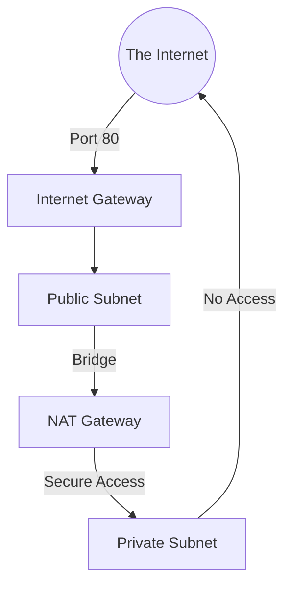

# 🕵️ Day 3: Private Isolation & NAT Gateways
> **Topic:** The Art of Hiding Your Infrastructure

---

## 🎯 1. The "Why" - Why are we doing this?
A database should **NEVER** have a public IP. If a hacker doesn't know where your database is, they can't attack it. We keep sensitive things in **Private Subnets**. But how do these private servers download updates? We use a **NAT Gateway**.

**Real World Use Case:** A NAT Gateway is like a **One-Way Mirror**. You can see the internet, but the internet cannot see you.

---

## 🛠️ 2. Core Concepts & Definitions
- **Private Subnet:** A subnet that does NOT have a direct route to an Internet Gateway.
- **NAT Gateway (Network Address Translation):** A service that allows private instances to connect to the internet while preventing the internet from initiating a connection with those instances.
- **Elastic IP (EIP):** A static, public IP address that we attach to the NAT Gateway.

---

## 🔍 3. Line-by-Line Code Explanation (`main.tf`)

```hcl
resource "aws_subnet" "private_subnet" {
  vpc_id     = aws_vpc.main.id
  cidr_block = "10.0.2.0/24"
  map_public_ip_on_launch = false
}
```
- **Line 6:** `map_public_ip_on_launch = false` - This is what makes it **Private**. Servers here get no Public IP.

```hcl
resource "aws_eip" "nat_eip" {
  domain = "vpc"
}
```
- **Line 12:** `aws_eip` - Reservces a permanent Public IP from AWS. The NAT Gateway needs this to talk to the internet.

```hcl
resource "aws_nat_gateway" "main_nat" {
  allocation_id = aws_eip.nat_eip.id
  subnet_id     = aws_subnet.public_subnet.id
}
```
- **Line 16:** `aws_nat_gateway` - The actual bridge.
- **Line 18:** `subnet_id` - **CRITICAL:** The NAT Gateway MUST sit in a **Public Subnet** so it can see the internet. It helps the private subnets "behind" it.

```hcl
resource "aws_route" "private_to_nat" {
  route_table_id         = aws_route_table.private_rt.id
  destination_cidr_block = "0.0.0.0/0"
  nat_gateway_id         = aws_nat_gateway.main_nat.id
}
```
- **Line 22:** `destination_cidr_block = "0.0.0.0/0"` - This means "All internet traffic."
- **Line 24:** `nat_gateway_id` - "Instead of going to the front door (IGW), send all your traffic to the NAT Gateway."

---

## 🏗️ 4. Architectural Design


---

## 🧠 5. Senior DevOps Insight
- **NAT Cost:** NAT Gateways are expensive ($30+/month). In testing, we often use **NAT Instances** (tiny T3.micro servers acting as gateways) to save money.
- **HA NAT:** If your NAT Gateway dies, your whole private network loses internet. In production, we put one NAT Gateway in EACH availability zone.

---

### 🛠️ Hands-on Tasks:
- [ ] Deploy the NAT Gateway.
- [ ] **Verification:** Check the Route Table for your private subnet. Does it point `0.0.0.0/0` to your NAT ID?

---
<p align="center">
  <b>Graduation progress: Day 3/20 ✅</b>
</p>
