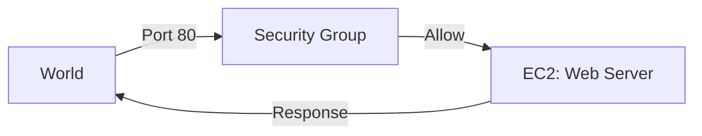

# 🚀 Day 4: EC2 Compute & Security Groups
> **Topic:** Launching Your First Web Server

---

## 🎯 1. The "Why" - Why are we doing this?
A VPC is just an empty building. **EC2 (Elastic Compute Cloud)** are the "employees" inside the building doing the work. However, every employee needs a security guard. **Security Groups** are the virtual firewalls that control who can talk to your server.

**Real World Use Case:** You have a web server. You want everyone to see your website (Port 80/443), but you only want YOUR IP address to be able to log in via SSH (Port 22).

---

## 🛠️ 2. Core Concepts & Definitions
- **AMI (Amazon Machine Image):** A template that contains the OS (Linux/Windows) and software.
- **Instance Type:** The size (CPU/RAM) of your server (e.g., `t2.micro`).
- **Security Group:** A stateful firewall that controls inbound and outbound traffic.
- **User Data:** A script that runs automatically the FIRST time a server starts.

---

## 🔍 3. Line-by-Line Code Explanation (`main.tf`)

```hcl
resource "aws_security_group" "web_sg" {
  name = "web-server-sg"
  vpc_id = aws_vpc.main.id

  ingress {
    from_port   = 80
    to_port     = 80
    protocol    = "tcp"
    cidr_blocks = ["0.0.0.0/0"]
  }
}
```
- **Line 6:** `aws_security_group` - The firewall creator.
- **Line 10:** `ingress` - Traffic coming **IN**.
- **Line 11-12:** `from_port = 80, to_port = 80` - Opening the HTTP port for websites.
- **Line 14:** `cidr_blocks = ["0.0.0.0/0"]` - Allowing the WHOLE WORLD.

```hcl
resource "aws_instance" "web_app" {
  ami           = "ami-0c101f26f1473a214" # Amazon Linux 2
  instance_type = "t2.micro"
  subnet_id     = aws_subnet.public_subnet.id
  vpc_security_group_ids = [aws_security_group.web_sg.id]

  user_data = <<-EOF
              #!/bin/bash
              yum update -y
              yum install -y httpd
              systemctl start httpd
              echo "<h1>Deployed via Terraform by ritik</h1>" > /var/www/html/index.html
              EOF
}
```
- **Line 26:** `aws_instance` - The server creator.
- **Line 27:** `ami` - We are using Amazon Linux 2.
- **Line 28:** `t2.micro` - The "Free Tier" instance size.
- **Line 30:** `vpc_security_group_ids` - Attaching our firewall to this server.
- **Line 32-38:** `user_data` - This script installs the Apache Web Server (`httpd`) and creates a custom "Hello" page automatically.

---

## 🏗️ 4. Architectural Design


---

## 🧠 5. Senior DevOps Insight
- **Least Privilege:** Never open Port 22 (SSH) to `0.0.0.0/0`. Only open it to your specific public IP.
- **Golden AMIs:** In production, we don't use `user_data` to install heavy software. We build an image (AMI) with the software already inside using a tool called **Packer**.

---

### 🛠️ Hands-on Tasks:
- [ ] Run `terraform apply`.
- [ ] Find your **Public IP** in the terminal output.
- [ ] Open your browser and go to `http://<YOUR-IP>`.
- [ ] **Verification:** Do you see the message "Deployed via Terraform by ritik"?

---
<p align="center">
  <b>Graduation progress: Day 4/20 ✅</b>
</p>
