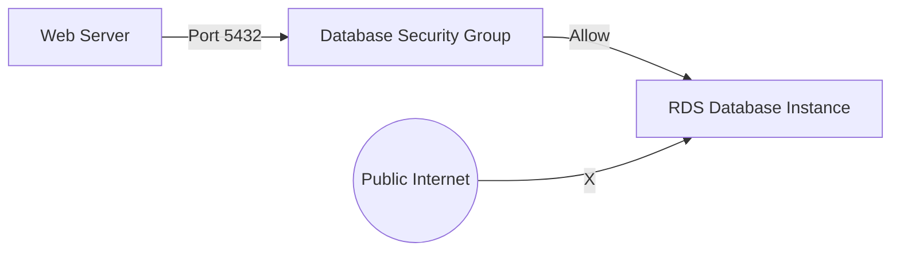

# 💾 Day 6: RDS Managed Databases
> **Topic:** Powering Your Apps with Secure Data

---

## 🎯 1. The "Why" - Why are we doing this?
In the old days, you had to install PostgreSQL on a server manually. This was a nightmare (backups, patches, scaling). **AWS RDS (Relational Database Service)** does all the hard work for you. It's a "Managed Service."

**Real World Use Case:** Your company's user data is too valuable to risk on a single server. RDS provides automated backups and high availability across multiple buildings (Multi-AZ).

---

## 🛠️ 2. Core Concepts & Definitions
- **DB Subnet Group:** A list of subnets where your database is allowed to live.
- **DB Instance:** The actual database server.
- **RDS Engine:** The software running (Postgres, MySQL, MariaDB, etc.).
- **Security Group Chaining:** Allowing access to the database ONLY from specific servers, not the whole internet.

---

## 🔍 3. Line-by-Line Code Explanation (`main.tf`)

```hcl
resource "aws_db_subnet_group" "db_group" {
  name       = "main-db-group"
  subnet_ids = [aws_subnet.private_1.id, aws_subnet.private_2.id]
}
```
- **Line 6:** `aws_db_subnet_group` - Security best practice.
- **Line 8:** `subnet_ids` - We put the database in **Private Subnets** so it's hidden from the public internet.

```hcl
resource "aws_db_instance" "main_db" {
  allocated_storage      = 20
  db_name                = "ritikdb"
  engine                 = "postgres"
  instance_class         = "db.t3.micro"
  username               = "ritik_admin"
  password               = var.db_password
  db_subnet_group_name   = aws_db_subnet_group.db_group.name
  skip_final_snapshot    = true
}
```
- **Line 12:** `allocated_storage = 20` - 20GB of disk space.
- **Line 15:** `db.t3.micro` - The Free Tier size.
- **Line 17:** `password = var.db_password` - **CRITICAL:** We use a variable so the password isn't visible in the code.
- **Line 19:** `skip_final_snapshot = true` - Allows us to delete the database quickly during this lab. In production, this should be `false`.

---

## 🏗️ 4. Architectural Design


---

## 🧠 5. Senior DevOps Insight
- **Never Use Public IPs for DBs:** Even if you have a password, a public database is a target for brute-force attacks.
- **Parameter Groups:** Use these to change database settings (like memory limits or logging) without digging into config files.

---

### 🛠️ Hands-on Tasks:
- [ ] Create a `variables.tf` file and define `db_password`.
- [ ] Run `terraform apply`.
- [ ] **Verification:** Go to the AWS Console -> RDS. Is your database "Creating" or "Available"? 

---
<p align="center">
  <b>Graduation progress: Day 6/20 ✅</b>
</p>
