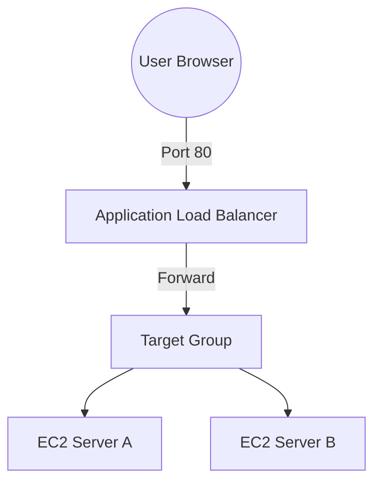

# 🚦 Day 7: Application Load Balancers (ALB)
> **Topic:** Scaling Content Delivery

---

## 🎯 Today's Mission
Create a **Traffic Cop** for your servers. The ALB will take requests from the internet and balance them across multiple instances to ensure your site never goes down.

---

## 🔍 Line-by-Line Code Breakdown

### ⚖️ Part 1: The Load Balancer
```hcl
resource "aws_lb" "web_alb" {
  load_balancer_type = "application"
  subnets            = [aws_subnet.public_1.id, aws_subnet.public_2.id]
}
```
- **Design:** ALBs work at Layer 7 (HTTP/HTTPS). They need to sit in **Public Subnets**.

### 🎯 Part 2: The Target Group
```hcl
resource "aws_lb_target_group" "web_tg" {
  health_check {
    path = "/health"
    interval = 30
  }
}
```
- **Health Check:** If a server stops responding, the ALB is smart enough to stop sending it traffic.

---

## 🏗️ Architectural Design


---

## 🧠 Senior DevOps Insight
- **Sticky Sessions:** If your app stores login data locally (bad!), you might need `stickiness` to keep a user on the same server.
- **SSL Termination:** In production, the ALB handles the HTTPS certificate so your servers don't have to.

---
<p align="center">
  <b>Graduation progress: Day 7/20 ✅</b>
</p>
