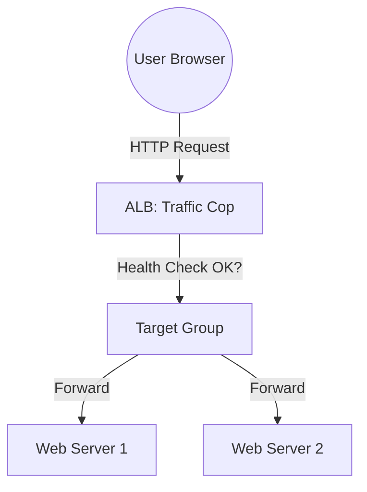

# 🚦 Day 7: Application Load Balancers (ALB)
> **Topic:** Scaling Content Delivery & Avoiding Downtime

---

## 🎯 1. The "Why" - Why are we doing this?
A single web server will eventually crash or get overwhelmed by traffic. An **Application Load Balancer (ALB)** sits in front of your servers and shares the traffic like a traffic cop.

**Real World Use Case:** Imagine Amazon.com on Black Friday. Millions of users arrive. One server can't handle them. The ALB spreads them across 1,000 servers. If one server dies, the ALB stops sending traffic to it (Health Checks).

---

## 🛠️ 2. Core Concepts & Definitions
- **Listener:** A process that checks for connection requests (e.g., listening on Port 80).
- **Target Group:** The collection of servers that the ALB will send traffic to.
- **Health Check:** A periodic ping from the ALB to your servers. If a server is "Sick," it's removed from traffic.
- **Layer 7:** This type of load balancer understands HTTP headers and paths (e.g., send `/images` to one server and `/api` to another).

---

## 🔍 3. Line-by-Line Code Explanation (`main.tf`)

```hcl
resource "aws_lb" "main_alb" {
  name               = "web-alb"
  internal           = false
  load_balancer_type = "application"
  security_groups    = [aws_security_group.alb_sg.id]
  subnets            = [aws_subnet.public_1.id, aws_subnet.public_2.id]
}
```
- **Line 7:** `internal = false` - This makes it **Internet-Facing**.
- **Line 10:** `subnets` - An ALB must sit in at least TWO public subnets in different zones to stay high-available.

```hcl
resource "aws_lb_target_group" "main_tg" {
  port     = 80
  protocol = "HTTP"
  vpc_id   = aws_vpc.main.id

  health_check {
    path = "/healthy"
    port = "traffic-port"
  }
}
```
- **Line 14:** `aws_lb_target_group` - This is where the servers "live" in the eyes of the ALB.
- **Line 19:** `health_check` - Every 30 seconds, the ALB will ask the server: *"Are you okay at /healthy?"*

---

## 🏗️ 4. Architectural Design


---

## 🧠 5. Senior DevOps Insight
- **Zero Downtime:** With an ALB, you can replace all your servers without the user ever seeing a "404" or a "Loading" screen.
- **WAF Integration:** You can attach a **Web Application Firewall (WAF)** to your ALB to block SQL Injection and DDoS attacks before they even reach your code.

---

### 🛠️ Hands-on Tasks:
- [ ] Create the ALB and Target Group.
- [ ] Connect your Day 4 EC2 instance to this Target Group.
- [ ] **Verification:** Open the ALB's DNS Name in your browser. Do you see your website?

---
<p align="center">
  <b>Graduation progress: Day 7/20 ✅</b>
</p>
