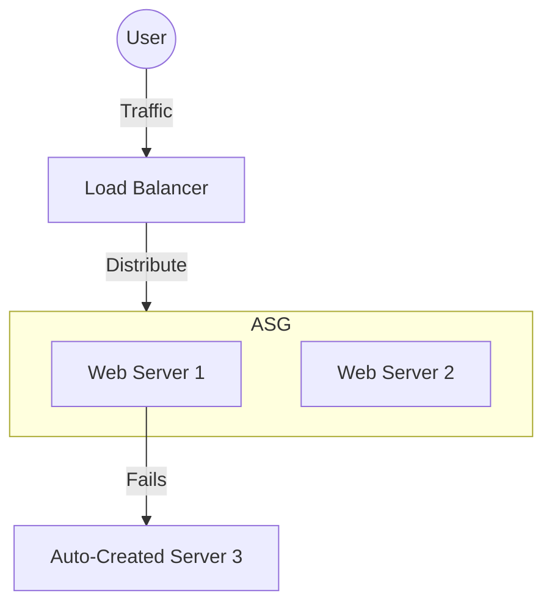

# 📈 Day 8: Auto Scaling Groups (ASG)
> **Topic:** Building Self-Healing Infrastructure

---

## 🎯 1. The "Why" - Why are we doing this?
If one web server dies at 3 AM while you are sleeping, your customers can't use your site. **Auto Scaling Groups (ASG)** are your night watchman. They monitor your servers 24/7.

**Real World Use Case:** High Availability. If an entire AWS data center (building) loses power, the ASG will automatically detect your servers are gone and "Re-spawn" them in a different building (Availability Zone) without you doing anything.

---

## 🛠️ 2. Core Concepts & Definitions
- **Launch Template:** The specification (blueprint) for the server.
- **Desired Capacity:** The ideal number of servers you want running.
- **Scaling Policy:** Rules that tell the ASG when to add more (e.g., "Add 2 servers if CPU > 70%").
- **Cooldown:** The waiting period after scaling to prevent "flapping" (repeatedly adding and removing).

---

## 🔍 3. Line-by-Line Code Explanation (`main.tf`)

```hcl
resource "aws_launch_template" "web_blueprint" {
  name_prefix   = "web-app-"
  image_id      = "ami-0c101f26f1473a214"
  instance_type = "t2.micro"
  
  network_interfaces {
    security_groups = [aws_security_group.web_sg.id]
  }
}
```
- **Line 6:** `aws_launch_template` - This is the "Recipe Book."
- **Line 8:** `image_id` - Tells AWS which OS to install on EVERY new server the ASG makes.

```hcl
resource "aws_autoscaling_group" "web_asg" {
  vpc_zone_identifier = [aws_subnet.private_1.id, aws_subnet.private_2.id]
  desired_capacity    = 2
  max_size            = 3
  min_size            = 1

  launch_template {
    id      = aws_launch_template.web_blueprint.id
    version = "$Latest"
  }
}
```
- **Line 15:** `vpc_zone_identifier` - Tells the ASG which Subnets it can use. We put them in **Private subnets** for security.
- **Line 16-18:** `desired/max/min` - This is the "Elasticity." We always want 2, but we can have up to 3 if busy, or 1 if idle.
- **Line 22:** `$Latest` - Tells the ASG to always use the newest version of our Blueprint (Launch Template).

---

## 🏗️ 4. Architectural Design


---

## 🧠 5. Senior DevOps Insight
- **Grace Period:** Set a `health_check_grace_period`. If your server takes 2 minutes to boot, the ASG shouldn't kill it after 30 seconds for being "unhealthy." Give it time to wake up!
- **Termination Protection:** For critical servers, you can tell the ASG "Don't kill this specific instance" if you are debugging it.

---

### 🛠️ Hands-on Tasks:
- [ ] Deploy the ASG.
- [ ] **The Chaos Test:** Go to the AWS Console, find one of the instances created by the ASG, and **Manually Terminate it**.
- [ ] **Verification:** Wait 2 minutes. Does a new instance appear automatically? (It should!)

---
<p align="center">
  <b>Graduation progress: Day 8/20 ✅</b>
</p>
