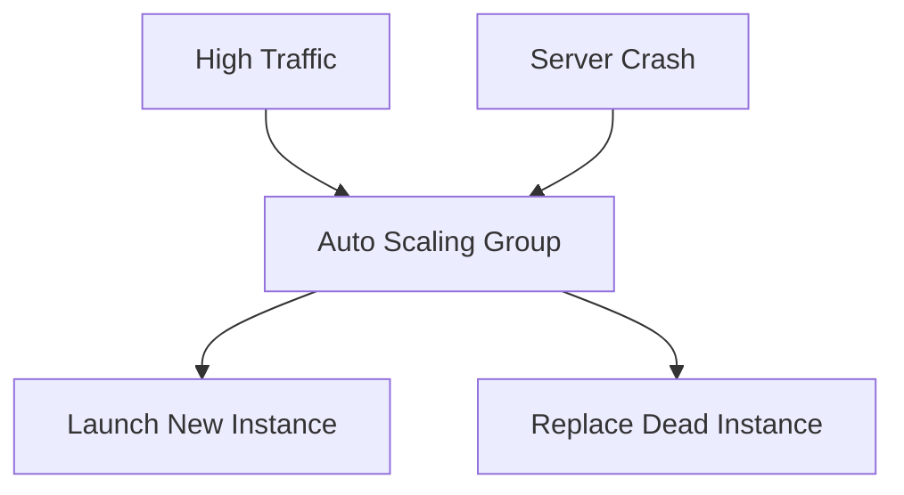

# 📈 Day 8: Auto Scaling Groups (ASG)
> **Topic:** Building Self-Healing Infrastructure

---

## 🎯 Today's Mission
Make your infrastructure **Unstoppable**. We will set up **Auto Scaling** so that if a server dies, a new one is born. If traffic spikes, your cluster grows. This is the heart of AWS scalability.

---

## 🔍 Line-by-Line Code Breakdown

### 📝 Part 1: The Blueprint (Launch Template)
```hcl
resource "aws_launch_template" "web_lt" {
  image_id      = "ami-..."
  instance_type = "t2.micro"
}
```
- **Definition:** This is the recipe. It tells AWS: "When you need a new server, use this OS and this size."

### 🔄 Part 2: The Logic (ASG)
```hcl
resource "aws_autoscaling_group" "web_asg" {
  desired_capacity    = 2
  max_size            = 3
  min_size            = 1
}
```
- **Desired:** How many servers you want normally.
- **Max:** The limit of your budget/scale.
- **Min:** The safety net.

---

## 🏗️ Architectural Design


---

## 🧠 Senior DevOps Insight
- **Grace Period:** Always set a `health_check_grace_period` (e.g., 300s). This gives your server time to boot up before the ASG starts checking if it's "Healthy."
- **Instance Refresh:** Use this feature to update all your servers across the cluster without a single second of downtime.

---
<p align="center">
  <b>Graduation progress: Day 8/20 ✅</b>
</p>
