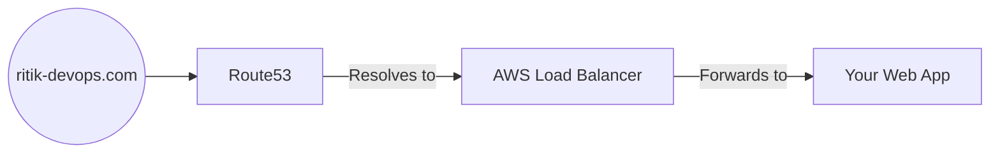

# 🌐 Day 9: Route53 & DNS Traffic Control
> **Topic:** Connecting Users to Your Cloud

---

## 🎯 1. The "Why" - Why are we doing this?
Users don't visit `http://54.21.34.12`. They visit `ritik-devops.com`. **Route53** is the phone book of the internet. It maps your human-readable domain to your ugly AWS infrastructure IDs.

**Real World Use Case:** In production, Route53 isn't just for names. It can do **Latancy Routing**. If a user is in India, it sends them to the Mumbai data center. If they are in the USA, it sends them to North Virginia.

---

## 🛠️ 2. Core Concepts & Definitions
- **Hosted Zone:** A container that holds information about how you want to route traffic for a domain.
- **A Record:** Points a domain directly to an IP address (e.g., `google.com -> 142.250...`).
- **Alias Record:** An AWS-specific record that points to other AWS resources (like Load Balancers) for free and with zero performance hit.
- **TTL (Time To Live):** How long a DNS server remembers your IP before asking Route53 again.

---

## 🔍 3. Line-by-Line Code Explanation (`main.tf`)

```hcl
resource "aws_route53_zone" "primary" {
  name = "ritik-devops.com"
}
```
- **Line 6:** `aws_route53_zone` - Creates the master record for your domain.

```hcl
resource "aws_route53_record" "www" {
  zone_id = aws_route53_zone.primary.zone_id
  name    = "www.ritik-devops.com"
  type    = "A"

  alias {
    name                   = aws_lb.main_alb.dns_name
    zone_id                = aws_lb.main_alb.zone_id
    evaluate_target_health = true
  }
}
```
- **Line 12:** `type = "A"` - Represents an "Address" record.
- **Line 14:** `alias` - This is the "Magic Connection."
- **Line 15:** `name = aws_lb.main_alb.dns_name` - Points your domain to the Load Balancer we made on Day 7.
- **Line 17:** `evaluate_target_health = true` - If the Load Balancer is down, Route53 will stop sending traffic there automatically.

---

## 🏗️ 4. Architectural Design


---

## 🧠 5. Senior DevOps Insight
- **Failover Routing:** You can set up a "Passive" website in an S3 bucket. If your main infrastructure goes down, Route53 can automatically send visitors to the "Under Maintenance" page.
- **Propagation:** DNS changes can take up to 48 hours to reach the whole world. Be patient!

---

### 🛠️ Hands-on Tasks:
- [ ] Create the Hosted Zone.
- [ ] **Verification:** Find your "Name Servers" in the AWS Console. These are the 4 URLs that you would give to GoDaddy or Namecheap to "Link" your domain to AWS.

---
<p align="center">
  <b>Graduation progress: Day 9/20 ✅</b>
</p>
