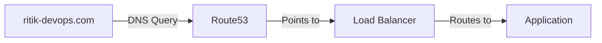

# 🌐 Day 9: Route53 & DNS Traffic Control
> **Topic:** Connecting Users to Your Cloud

---

## 🎯 Today's Mission
Transform messy IP addresses into clean domain names. Today we master **Route53**, AWS's highly available DNS service.

---

## 🔍 Line-by-Line Code Breakdown

### 🗺️ Part 1: The Domain Zone
```hcl
resource "aws_route53_zone" "primary" {
  name = "ritik-devops.com"
}
```
- **Hosted Zone:** The container for all your records.

### 🔗 Part 2: The Alias Record
```hcl
resource "aws_route53_record" "www" {
  alias {
    name    = aws_lb.web_alb.dns_name
    zone_id = aws_lb.web_alb.zone_id
  }
}
```
- **Alias:** This is superior to a CNAME. It points your domain directly to the Load Balancer with better performance and no extra cost.

---

## 🏗️ Architectural Design


---

## 🧠 Senior DevOps Insight
- **Routing Policies:** Check out **Failover Routing**. It allows you to send traffic to a "Static Maintenance Page" in S3 if your main website goes down.
- **Health Checks:** You can tell Route53 to "Stop sending traffic" to an entire region if the health check fails.

---
<p align="center">
  <b>Graduation progress: Day 9/20 ✅</b>
</p>
