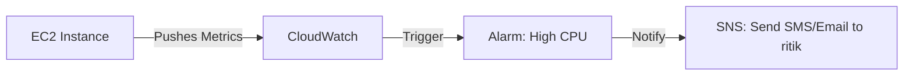

# 👁️ Day 10: CloudWatch Monitoring & Alerts
> **Topic:** Becoming the Omniscient Engineer

---

## 🎯 Today's Mission
If a server crashes in the forest and no one is monitoring it, does it matter? Today we ensure you are the first to know about issues. We will set up **Metics**, **Logs**, and **Alarms**.

---

## 🔍 Line-by-Line Code Breakdown

### ⏰ Part 1: The Alarm
```hcl
resource "aws_cloudwatch_metric_alarm" "high_cpu" {
  metric_name = "CPUUtilization"
  threshold   = "80"
  statistic   = "Average"
}
```
- **Logic:** "If CPU stays above 80% for 4 minutes, notify me."

### 📝 Part 2: The Logs
```hcl
resource "aws_cloudwatch_log_group" "app_logs" {
  retention_in_days = 7
}
```
- **History:** Collects console output from your servers so you can debug without logging into the machine.

---

## 🏗️ Architectural Design


---

## 🧠 Senior DevOps Insight
- **Custom Metrics:** Don't just monitor CPU. Monitor **Business Metrics** (e.g., "Number of successful checkouts").
- **Cost Tip:** CloudWatch can get expensive. Monitor only what matters and set reasonable log retention.

---
<p align="center">
  <b>Graduation progress: Day 10/20 ✅</b>
</p>
