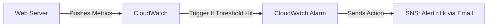

# 👁️ Day 10: CloudWatch Monitoring & Alerts
> **Topic:** Becoming the Omniscient Engineer

---

## 🎯 1. The "Why" - Why are we doing this?
If a server crashes in the middle of the night, how do you know? If your database is running out of disk space, how do you know? **CloudWatch** is the "Eyes and Ears" of AWS. It prevents disasters by alerting you before things break.

**Real World Use Case:** You set up an alarm: *"If CPU is > 80% for 5 minutes, send a message to the DevOps Slack channel."* This allows you to scale up or fix the issue before the website crashes for users.

---

## 🛠️ 2. Core Concepts & Definitions
- **Metric:** A variable that is measured over time (e.g., CPU Usage, Disk Read, Network In).
- **Alarm:** A trigger that fires when a metric crosses a threshold.
- **Log Group:** A container for application console logs.
- **SNS (Simple Notification Service):** The mechanism that actually sends the Email or SMS.

---

## 🔍 3. Line-by-Line Code Explanation (`main.tf`)

```hcl
resource "aws_cloudwatch_metric_alarm" "high_cpu" {
  alarm_name          = "cpu-overload"
  comparison_operator = "GreaterThanOrEqualToThreshold"
  evaluation_periods  = "2"
  metric_name        = "CPUUtilization"
  namespace           = "AWS/EC2"
  period              = "120"
  statistic           = "Average"
  threshold           = "80"
}
```
- **Line 6:** `aws_cloudwatch_metric_alarm` - The watcher.
- **Line 8:** `GreaterThanOrEqualToThreshold` - The logic.
- **Line 10:** `CPUUtilization` - What we are watching.
- **Line 11:** `namespace = "AWS/EC2"` - Tells CloudWatch to look at servers, not databases.
- **Line 13:** `threshold = "80"` - The danger zone. If CPU hits 80%, sound the alarm.

```hcl
resource "aws_cloudwatch_log_group" "web_logs" {
  name              = "/aws/ec2/web-server"
  retention_in_days = 7
}
```
- **Line 17:** `aws_cloudwatch_log_group` - Creating the storage for logs.
- **Line 19:** `retention_in_days = 7` - **Cost Saving:** Automatically delete logs older than 7 days. In prod, we might keep them for 30 or 90 days.

---

## 🏗️ 4. Architectural Design


---

## 🧠 5. Senior DevOps Insight
- **Dashboards:** Don't just rely on alarms. Create a **CloudWatch Dashboard** so management can see the "Health" of the system in one beautiful screen.
- **Resolution:** For critical apps, use **High Resolution Metrics** (1-second intervals) to catch micro-spikes that 1-minute metrics might miss.

---

### 🛠️ Hands-on Tasks:
- [ ] Create the Alarm and the Log Group.
- [ ] **Verification:** Check the CloudWatch Console -> Alarms. Is your `cpu-overload` alarm visible?

---
<p align="center">
  <b>Graduation progress: Day 10/20 ✅</b>
</p>
