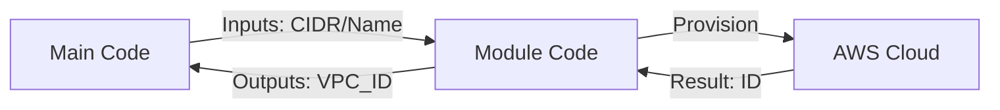

# 🏗️ Day 11: Terraform Modules
> **Topic:** The Art of Reusable Code

---

## 🎯 1. The "Why" - Why are we doing this?
If you have 5 different projects, do you want to write the VPC code 5 times? No. That leads to mistakes. **Modules** allow you to package your best code (like a VPC template) and share it across the whole company.

**Real World Use Case:** A Senior DevOps engineer (like me) writes the "Master Module" for security. All other developers just "Call" that module. This ensures every team follows the same security rules.

---

## 🛠️ 2. Core Concepts & Definitions
- **Child Module:** The actual code (VPC, RDS) inside a sub-folder.
- **Root Module:** The main folder where you run `terraform apply`.
- **Input Variables:** How you customize a module (e.g., changing the CIDR).
- **Module Registry:** A place (like GitHub or HashiCorp Registry) where you can download pre-made modules.

---

## 🔍 3. Line-by-Line Code Explanation (`main.tf`)

```text
📂 vpc-module (The Library)
 ┣ 📜 main.tf      # The resource definitions
 ┣ 📜 variables.tf # What can we customize?
 ┗ 📜 outputs.tf   # What do we tell the main code?
```

```hcl
# In your ROOT main.tf
module "my_vpc" {
  source   = "./vpc-module"
  vpc_cidr = "10.0.0.0/16"
  region   = "us-east-1"
}
```
- **Line 6:** `module "my_vpc"` - This is like "importing" a library in Python or Java.
- **Line 7:** `source` - Tells Terraform where the code is hidden.
- **Line 8-9:** These are **Inputs**. You are telling the module: *"Build me a VPC, but use this specific size."*

---

## 🏗️ 4. The Data Flow


---

## 🧠 5. Senior DevOps Insight
- **Don't Over-Engineer:** A module should do ONE thing well. Don't make a "Mega-Module" that builds VPC, EC2, and RDS all at once. It will be impossible to manage.
- **Versioning:** In production, always point to a specific Git version (e.g., `v1.2.0`). If someone breaks the module in the future, your project stays safe because you are using the old version.

---

### 🛠️ Hands-on Tasks:
- [ ] Look into the `vpc-module` folder.
- [ ] Run `terraform init`. You will see it says "Initializing Modules."
- [ ] **Challenge:** Try to change the `vpc_cidr` in your root file and run `plan`. See how the module reacts.

---
<p align="center">
  <b>Graduation progress: Day 11/20 ✅</b>
</p>
