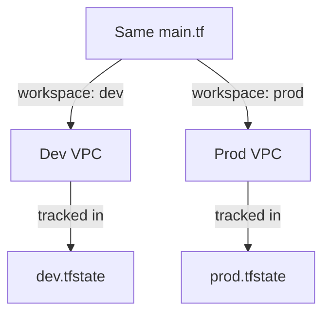

# 🏢 Day 12: Terraform Workspaces
> **Topic:** Managing Multiple Environments like a Pro

---

## 🎯 1. The "Why" - Why are we doing this?
Imagine you have a `Dev`, `Staging`, and `Prod` environment. Do you copy the code 3 times? No! That's how you get out-of-sync bugs. **Workspaces** allow you to use the **exact same code** for all three, while keeping their state files (and resources) completely separate.

**Real World Use Case:** You write a new feature. You test it in the `dev` workspace. Once it's perfect, you switch to `prod` and run the same code. This ensures what you tested is EXACTLY what you deploy to customers.

---

## 🛠️ 2. Core Concepts & Definitions
- **Default Workspace:** The workspace you start in (don't use this for production!).
- **State Isolation:** Each workspace has its own `terraform.tfstate` file.
- **Workspace Interpolation:** Using `${terraform.workspace}` in your code to change names based on the environment.

---

## 🔍 3. Line-by-Line Code Explanation (`main.tf`)

```hcl
resource "aws_vpc" "workspace_vpc" {
  cidr_block = "10.0.0.0/16"
  tags = {
    Name = "${terraform.workspace}-vpc"
    Env  = terraform.workspace
  }
}
```
- **Line 6:** `${terraform.workspace}` - This is a **Global variable**.
- If you run `terraform workspace select dev`, the VPC name becomes `dev-vpc`.
- If you run `terraform workspace select prod`, it becomes `prod-vpc`.

---

## 🏗️ 4. Architectural Design


---

## 🧠 5. Senior DevOps Insight
- **When NOT to use Workspaces:** For extremely complex architectures, workspaces can be confusing. Many top teams prefer separate **folders** (e.g., `envs/dev/`, `envs/prod/`) so they can have different versions of modules for different environments.
- **Safety:** Always add a tag or an output that clearly states which workspace you are in.

---

### 🛠️ Hands-on Tasks:
- [ ] Create a new workspace: `terraform workspace new dev`.
- [ ] Run `terraform apply`.
- [ ] Create another: `terraform workspace new prod`.
- [ ] Run `terraform apply` again.
- [ ] **Verification:** Check the AWS Console. Do you see TWO different VPCs with different names?

---
<p align="center">
  <b>Graduation progress: Day 12/20 ✅</b>
</p>
