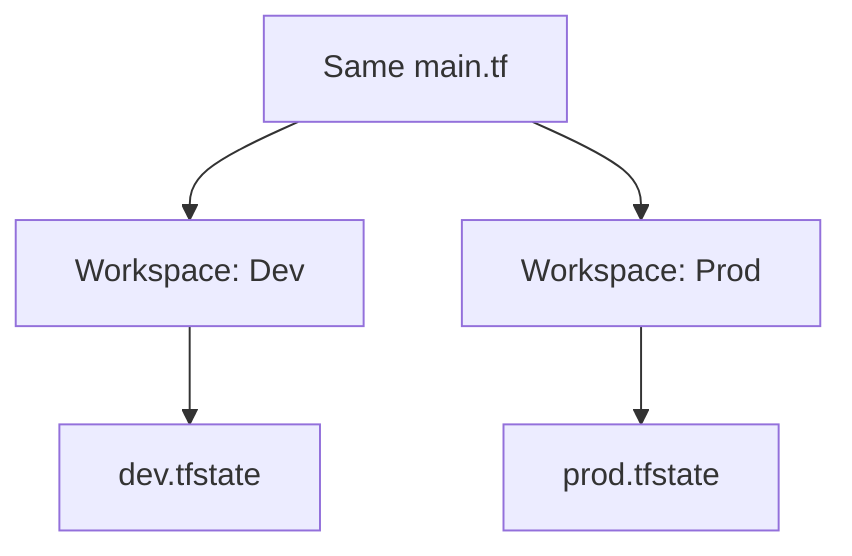

# 🏢 Day 12: Terraform Workspaces
> **Topic:** Managing Multiple Environments like a Pro

---

## 🎯 Today's Mission
Learn how to manage **Dev**, **Staging**, and **Production** using the exact same code. No more copying folders! We will use **Workspaces** to isolate state files for different environments.

---

## 🔍 Line-by-Line Code Breakdown

### 🏢 Part 1: Environment Isolation
```hcl
resource "aws_vpc" "main" {
  cidr_block = "10.0.0.0/16"
  tags = {
    Name = "${terraform.workspace}-vpc"
  }
}
```
- **The Variable:** `${terraform.workspace}` automatically changes to "dev" or "prod" depending on which workspace you are in.

---

## 🏗️ Workflow Design


---

## 🧠 Senior DevOps Insight
- **When NOT to use Workspaces:** Use Workspaces for identical environments. If your Production is vastly different (different regions, different providers) from Dev, it's better to use **Separate Directories**.
- **Context:** Always check `terraform workspace show` before running `apply` so you don't accidentally delete production!

---
<p align="center">
  <b>Graduation progress: Day 12/20 ✅</b>
</p>
