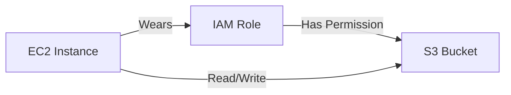

# 👮 Day 15: IAM Roles for EC2 (The Right Way)
> **Topic:** Master-Level Security and Identity

---

## 🎯 Today's Mission
Stop using Access Keys for your servers. Today we learn about **IAM Roles** and **Instance Profiles**. This allows your EC2 instances to talk to S3 or RDS automatically without you ever having to store credentials on the server.

---

## 🔍 Line-by-Line Code Breakdown

### 🎭 Part 1: The Trust Policy
```hcl
resource "aws_iam_role" "ec2_role" {
  assume_role_policy = jsonencode({ ... })
}
```
- **Trust:** This tells AWS: *"I trust the EC2 service to wear this 'mask' (role)."*

### 🗝️ Part 2: The Instance Profile
```hcl
resource "aws_iam_instance_profile" "ec2_profile" {
  role = aws_iam_role.ec2_role.name
}
```
- **The Container:** This is the physical object that "carries" the role and attaches it to the server.

---

## 🏗️ Architectural Design


---

## 🧠 Senior DevOps Insight
- **Principle of Least Privilege:** Never give a role `AdministratorAccess`. Only give it exactly what it needs (e.g., `s3:GetObject`).
- **Security Audit:** Use the **IAM Access Analyzer** to see if your roles are too powerful or have unused permissions.

---
<p align="center">
  <b>Graduation progress: Day 15/20 ✅</b>
</p>
