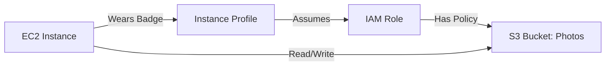

# 👮 Day 15: IAM Roles for EC2 (The Right Way)
> **Topic:** Identity & Security at Scale

---

## 🎯 1. The "Why" - Why are we doing this?
In Day 1, we created users with passwords. In a real job, you **NEVER** put passwords or access keys inside a server. If a hacker gets into the server, they get your keys. We use **IAM Roles** to allow the server itself to "assume" an identity without any hardcoded credentials.

**Real World Use Case:** Your web server needs to upload profile pictures to an S3 bucket. Instead of giving the server a key, you give it a **Role**. AWS automatically handles the rotation of security tokens every few hours.

---

## 🛠️ 2. Core Concepts & Definitions
- **IAM Role:** An identity with specific permissions, intended to be "assumed" by anyone who needs it (service or person).
- **Assume Role Policy:** A document that defines "Who is allowed to wear this mask?" (e.g., "Only EC2 instances can assume this role").
- **Instance Profile:** A container for an IAM role that you attach to an EC2 instance.
- **Trust Relationship:** The bond between the identity and the service.

---

## 🔍 3. Line-by-Line Code Explanation (`main.tf`)

```hcl
resource "aws_iam_role" "ec2_s3_role" {
  name = "web-server-s3-role"

  assume_role_policy = jsonencode({
    Version = "2012-10-17"
    Statement = [
      {
        Action = "sts:AssumeRole"
        Effect = "Allow"
        Principal = {
          Service = "ec2.amazonaws.com"
        }
      }
    ]
  })
}
```
- **Line 6:** `aws_iam_role` - Creating the identity.
- **Line 11:** `sts:AssumeRole` - This is the key action. It allows the server to "become" this role.
- **Line 14:** `Service = "ec2.amazonaws.com"` - This is the **Trust Policy**. It says ONLY the EC2 service is allowed to use this role.

```hcl
resource "aws_iam_instance_profile" "web_profile" {
  name = "web-instance-profile"
  role = aws_iam_role.ec2_s3_role.name
}
```
- **Line 22:** `aws_iam_instance_profile` - This is the physical "badge" that holds the role. You attach this profile to the EC2 instance, not the role directly.

---

## 🏗️ 4. Architectural Design


---

## 🧠 5. Senior DevOps Insight
- **Cross-Account Access:** IAM Roles are the secret to cross-account management. You can have a "Security Role" in Account A that a user in Account B can assume to do their audit work.
- **Security Check:** Run `curl http://169.254.169.254/latest/meta-data/iam/security-credentials/` from your server. AWS will show you the temporary tokens—no keys needed!

---

### 🛠️ Hands-on Tasks:
- [ ] Create the Role, Policy, and Instance Profile.
- [ ] Terminate your old Day 4 EC2 and launch a new one with the `iam_instance_profile` attached.
- [ ] **Verification:** Log into the EC2 and run `aws s3 ls`. If it works without you running `aws configure`, you have successfully implemented IAM Roles!

---
<p align="center">
  <b>Graduation progress: Day 15/20 ✅</b>
</p>
