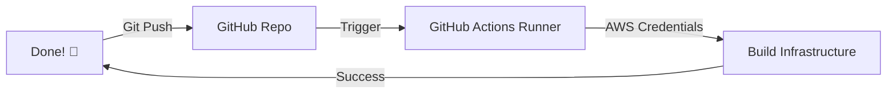

# 🤖 Day 16: Automated CI/CD with GitHub Actions
> **Topic:** Infrastructure at the Speed of Code

---

## 🎯 Today's Mission
Automate yourself out of a job. Today we build a **CI/CD Pipeline**. Every time you push code to GitHub, a "Robot" will automatically run `terraform plan` and `terraform apply`. No more typing commands manually!

---

## 🔍 Line-by-Line Code Breakdown

### 🔧 Part 1: The Trigger
```yaml
on:
  push:
    branches: [ main ]
```
- **Event:** "Whenever code is pushed to the main branch, start the robot."

### 🤖 Part 2: The Steps
```yaml
steps:
  - name: Terraform Plan
    run: terraform plan
```
- **The Robot's Work:** It checks out your code, sets up the AWS credentials, and runs the Terraform lifecycle.

---

## 🏗️ The GitOps Architecture


---

## 🧠 Senior DevOps Insight
- **Terraform Cloud:** For larger teams, consider using **Terraform Cloud** or **Spacelift**. They provide beautiful UIs for your pipelines and handle state locking automatically.
- **Review Culture:** In production, always require a **Pull Request Review** before the code can be applied to the main environment.

---
<p align="center">
  <b>Graduation progress: Day 16/20 ✅</b>
</p>
