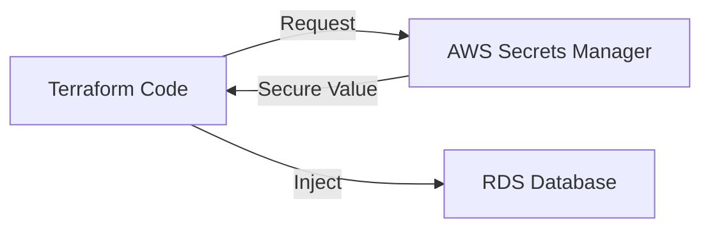

# 🔐 Day 17: Secrets Management
> **Topic:** Hiding the Most Sensitive Data

---

## 🎯 Today's Mission
Never, ever, ever commit passwords to Git. Today we learn how to use **AWS Secrets Manager** to store database passwords and API keys securely. We will fetch these secrets dynamically in our Terraform code.

---

## 🔍 Line-by-Line Code Breakdown

### 🗝️ Part 1: Storing the Secret
```hcl
resource "aws_secretsmanager_secret" "db_password" {
  name = "prod/db/secret"
}
```
- **The Box:** Creates a secure location in AWS to store a value.

### 📥 Part 2: Fetching the Secret
```hcl
data "aws_secretsmanager_secret_version" "pass" {
  secret_id = aws_secretsmanager_secret.db_password.id
}
```
- **The Key:** Terraform goes to AWS, pulls the latest secret, and uses it inside your code without you ever seeing it in plain text.

---

## 🏗️ Architectural Design


---

## 🧠 Senior DevOps Insight
- **Rotation:** Secrets Manager can automatically change (rotate) your passwords every 30 days. This means even if a hacker gets a password, it's useless after a month.
- **Access Control:** Use **IAM Policies** to ensure only the web server can read the secret, and not just any user in the account.

---
<p align="center">
  <b>Graduation progress: Day 17/20 ✅</b>
</p>
