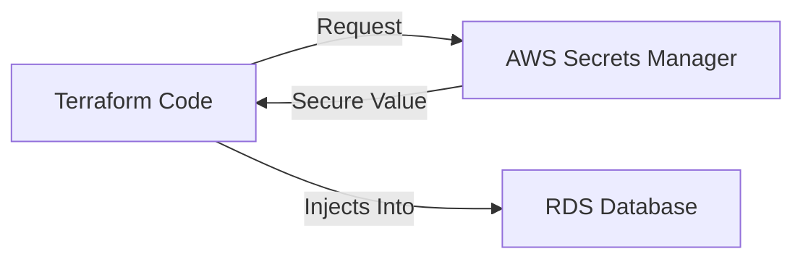

# 🔐 Day 17: AWS Secrets Manager
> **Topic:** Hiding the Most Critical Information

---

## 🎯 1. The "Why" - Why are we doing this?
Code is public (or at least visible to all coworkers). Passwords should be secret. If you hardcode a database password in your `variables.tf`, any developer can see it. **AWS Secrets Manager** is an encrypted vault for passwords.

**Real World Use Case:** Your database password needs to change every 90 days. Instead of you manually updating 100 servers, Secrets Manager can "Rotate" the password automatically and tell the servers the new one.

---

## 🛠️ 2. Core Concepts & Definitions
- **Secret:** The "Box" where you store the name of the credential.
- **Secret Version:** The actual "Value" inside the box (which can change over time).
- **JSON Secret:** You can store multiple values (Username, Password, Port) in one secret.
- **Rotation:** The automated process of changing the password.

---

## 🔍 3. Line-by-Line Code Explanation (`main.tf`)

```hcl
resource "aws_secretsmanager_secret" "db_pass" {
  name = "database-passwordv1"
}
```
- **Line 6:** `aws_secretsmanager_secret` - Creating the "Box".

```hcl
resource "aws_secretsmanager_secret_version" "example" {
  secret_id     = aws_secretsmanager_secret.db_pass.id
  secret_string = "Sup3rS3cretP@ssword"
}
```
- **Line 11:** `secret_string` - This is the actual password. Note: Usually you would set this manually in the AWS UI or via CLI, not in plain text Terraform, but we do it here for the lab.

```hcl
data "aws_secretsmanager_secret_version" "retrieved" {
  secret_id = aws_secretsmanager_secret.db_pass.id
}
```
- **Line 16:** `data` - Fetching the secret back. This is how your servers get the password without you hardcoding it.

---

## 🏗️ 4. Architectural Design


---

## 🧠 5. Senior DevOps Insight
- **Encryption:** Secrets Manager uses **AWS KMS (Key Management Service)**. This means even AWS employees cannot see your password unless they have the decryption key.
- **Cross-Service:** You can sharing secrets across different AWS accounts (e.g., sharing a database password from the 'DB Account' to the 'Web Account').

---

### 🛠️ Hands-on Tasks:
- [ ] Deploy the Secret resources.
- [ ] **Verification:** Go to the AWS Console -> Secrets Manager. Find your secret and click "Retrieve Secret Value." Do you see your password?

---
<p align="center">
  <b>Graduation progress: Day 17/20 ✅</b>
</p>
