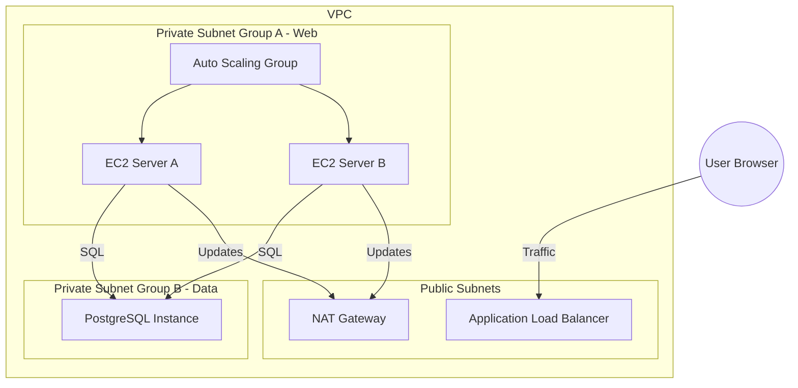

# 🎓 Day 18-20: The Grand Finale - 3-Tier Enterprise Project
> **Topic:** Graduation Day - Building for Production

---

## 🎯 1. The "Goal" - Your Masterpiece
You are now ready. Over the next 3 days, you will use every single skill you've learned—Networking, Security, Compute, Logic, and Automation—to build a **Production-Ready 3-Tier Web Architecture**.

### The 3 Tiers:
1. **Presentation Tier (ALB):** Publicly accessible load balancer.
2. **Application Tier (EC2/ASG):** Private web servers that grow and shrink with traffic.
3. **Data Tier (RDS):** A secure, private database.

---

## 🛠️ 2. The Final Checklist (Industry Standard)
- [ ] **VPC Architecture:** 4 Subnets (2 Public, 2 Private) across 2 Availability Zones for high-availability.
- [ ] **Networking:** Internet Gateway for the public tier, NAT Gateway for the private tier.
- [ ] **Compute:** Auto Scaling Group with a Launch Template using the proper Amazon Linux AMI.
- [ ] **Security:** Security Group Chaining.
  - ALB Security Group: Allows Port 80 from `0.0.0.0/0`.
  - EC2 Security Group: Allows Port 80 ONLY from the ALB's SG.
  - DB Security Group: Allows Port 5432 ONLY from the EC2's SG.
- [ ] **DNS:** Route53 Alias record pointing your domain to the ALB.
- [ ] **Secrets:** Database credentials must be fetched from Secrets Manager.

---

## 🏗️ 3. Master Architecture Diagram

---

## 🧠 4. Senior DevOps Graduation Speech
- **Design for Failure:** Always assume a server will die. Always assume a whole building (AZ) will go dark. If your architecture handles this, you are a Senior.
- **Cost vs. Performance:** Monitor your ALB traffic. If you have only 10 users, you don't need 10 servers. Use Auto-Scaling to save your company money.
- **Terraform Destroy:** Once you have shown your work, run `terraform destroy`. A true engineer cleans up their workspace.

---

### 🏆 Your Final Task:
1. Build the code in `labs/day18-20-final-project`.
2. Run `terraform apply`.
3. Verify that you can reach your website via the ALB DNS or your Route53 Domain.
4. **Graduate:** You have completed the 20-day journey. 🛡️🎓

---

  <b>Bootcamp Status: 100% COMPLETE 🏆🎓✅</b>

