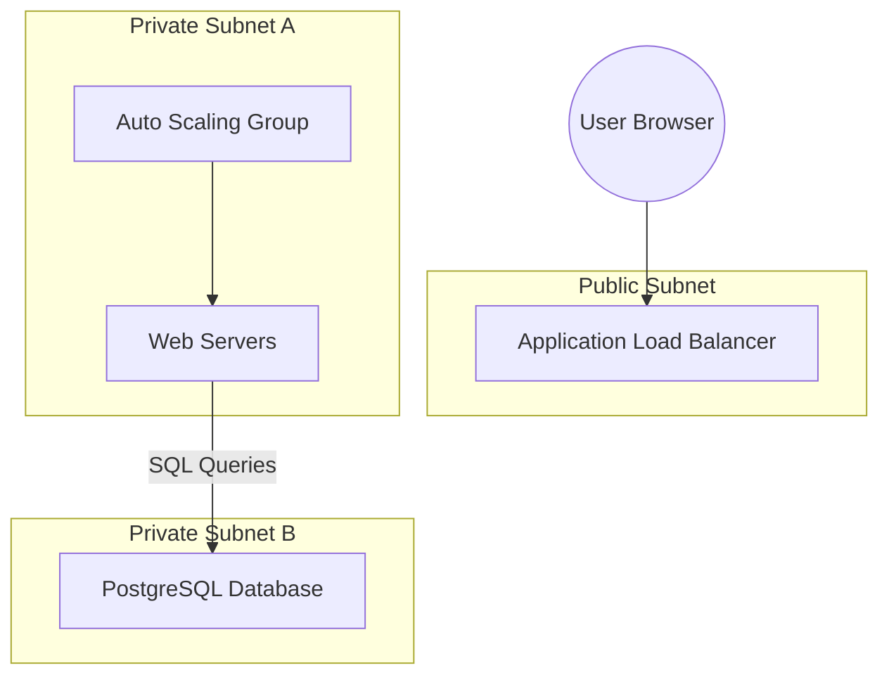

# 🏆 Day 18-20: The Grand Finale - 3-Tier Enterprise Project
> **Topic:** Graduation Day - Building for Production

---

## 🎯 Your Ultimate Mission
This is it. The big one. Over the next 3 days, you will combine EVERYTHING you have learned to build a **Full 3-Tier Architecture**. 

### What you are building:
1. **Tier 1 (Web):** A Public Load Balancer (ALB) and Auto Scaling Group (ASG) for the web servers.
2. **Tier 2 (App):** Application servers isolated in private subnets.
3. **Tier 3 (DB):** A secure, managed RDS Database.

---

## 🏗️ The Master Architecture

---

## 🔍 The Graduation Checklist
- [ ] **Networking:** VPC with Public and Private subnets across 2 Availability Zones.
- [ ] **Security:** Security Groups chained together (ALB -> EC2 -> DB).
- [ ] **Automation:** All passwords fetched from **Secrets Manager**.
- [ ] **Reliability:** Auto Scaling and Health Checks configured.
- [ ] **DNS:** Point your Route53 domain to the ALB.

---

## 🧠 Final Boss Advice
- **Test the Failure:** After you build it, manually terminate one of your EC2 instances. Does the ASG bring it back? If so, you have passed the test.
- **Cost Awareness:** This lab uses multiple resources. Remember to run `terraform destroy` once you have finished showing off your work!

---

  <b>Graduation progress: Day 20/20 🏆🎓</b> 
  <i>"Congratulations, ritik. You are now a Senior DevOps Engineer."</i>

